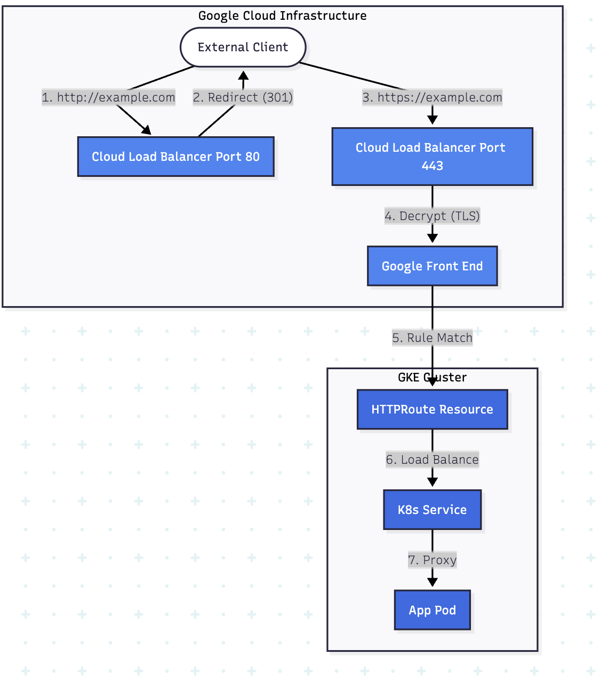

Below is a **simple, complete Gateway API example on GKE**, including **HTTP → HTTPS redirect** and **TLS with Google-managed certificates**.

This is the **modern replacement** for GCE Ingress and is **recommended by Google** for new setups.

---

## Architecture (what you’ll create)

* **Gateway** → Google Cloud HTTPS Load Balancer
* **HTTPRoute** → routing + redirect
* **Certificate Manager** → Google-managed TLS cert

---

## 1️⃣ Prerequisites

* GKE **v1.26+** (Autopilot or Standard)
* Gateway API enabled (usually already enabled)

Check:

```bash
kubectl get gatewayclass
```

You should see:

```
gke-l7-global-external-managed
```

---

## 2️⃣ Create a Google-managed certificate (Certificate Manager)

```yaml
apiVersion: networking.gke.io/v1
kind: ManagedCertificate
metadata:
  name: example-cert
spec:
  domains:
    - example.com
```

Apply:

```bash
kubectl apply -f cert.yaml
```

---

## 3️⃣ Create the Gateway (HTTPS + HTTP)

```yaml
apiVersion: gateway.networking.k8s.io/v1
kind: Gateway
metadata:
  name: example-gateway
spec:
  gatewayClassName: gke-l7-global-external-managed
  listeners:
  - name: http
    protocol: HTTP
    port: 80
  - name: https
    protocol: HTTPS
    port: 443
    tls:
      mode: Terminate
      certificateRefs:
      - kind: ManagedCertificate
        group: networking.gke.io
        name: example-cert
```

Apply:

```bash
kubectl apply -f gateway.yaml
```

---

## 4️⃣ HTTP → HTTPS Redirect (HTTPRoute)

```yaml
apiVersion: gateway.networking.k8s.io/v1
kind: HTTPRoute
metadata:
  name: http-redirect
spec:
  parentRefs:
  - name: example-gateway
    sectionName: http
  rules:
  - filters:
    - type: RequestRedirect
      requestRedirect:
        scheme: https
        statusCode: 301
```

---

## 5️⃣ HTTPS Traffic Routing to Service

```yaml
apiVersion: gateway.networking.k8s.io/v1
kind: HTTPRoute
metadata:
  name: app-route
spec:
  parentRefs:
  - name: example-gateway
    sectionName: https
  hostnames:
  - example.com
  rules:
  - backendRefs:
    - name: my-service
      port: 80
```

Apply both routes:

```bash
kubectl apply -f routes.yaml
```

---

## 6️⃣ Get the external IP

```bash
kubectl get gateway example-gateway
```

Example:

```
ADDRESS        PROGRAMMED
34.120.xxx.xxx True
```

➡️ Point your domain’s **A record** to this IP.

---

## 7️⃣ Test it

```bash
curl -I http://example.com
```

Expected:

```
HTTP/1.1 301 Moved Permanently
Location: https://example.com/
```

---

## ✅ Why Gateway API is better than Ingress

| Feature             | Ingress          | Gateway API    |
| ------------------- | ---------------- | -------------- |
| HTTP→HTTPS redirect | FrontendConfig   | Native         |
| TLS                 | Annotation-based | First-class    |
| Routing flexibility | Limited          | Advanced       |
| Future support      | Legacy           | 🚀 Recommended |

---

## 🧠 Notes / Gotchas

* Wildcard certs still require **Certificate Manager**
* ManagedCertificate works **only on GKE**
* Changes may take **5–15 minutes** to propagate

---

If you want, I can:

* Convert your **existing Ingress → Gateway**
* Show **multi-domain / multi-service routing**
* Add **Cloud Armor** or **IAP** to the Gateway

Just tell me 👍


